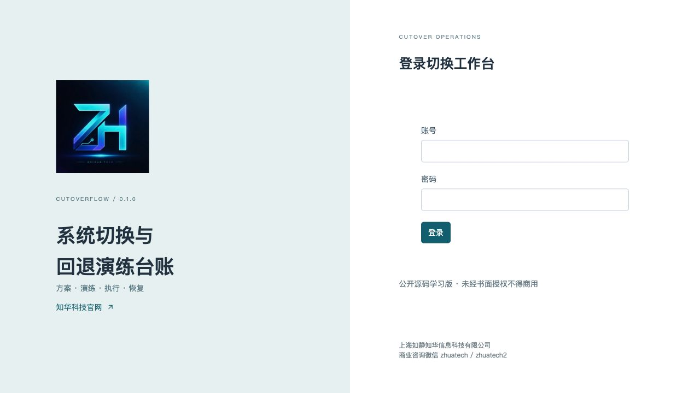
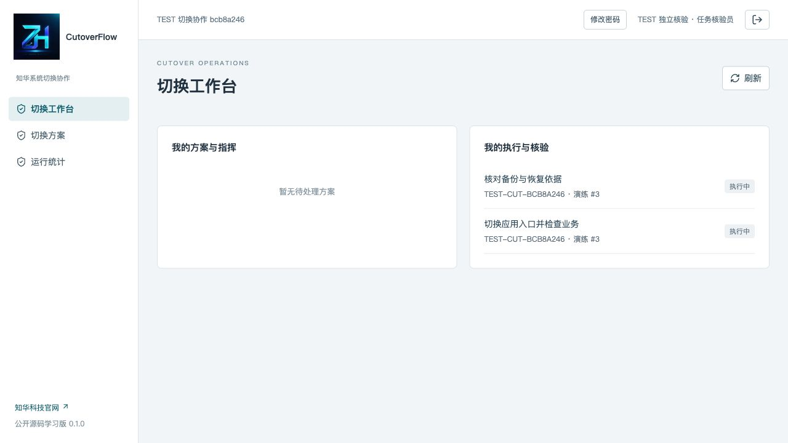
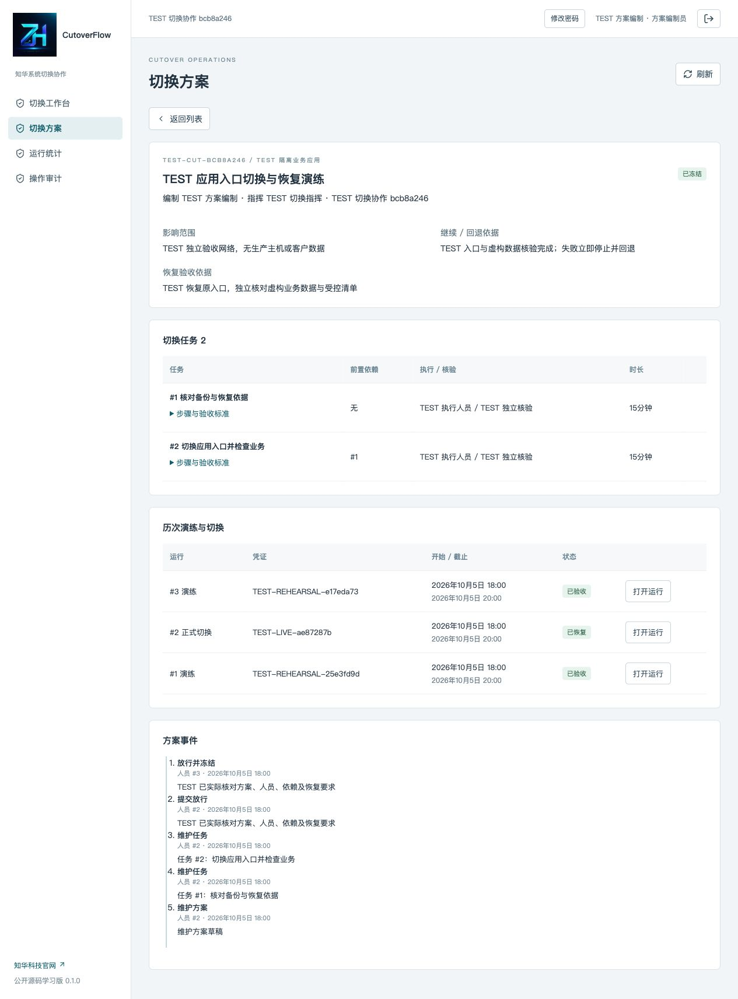
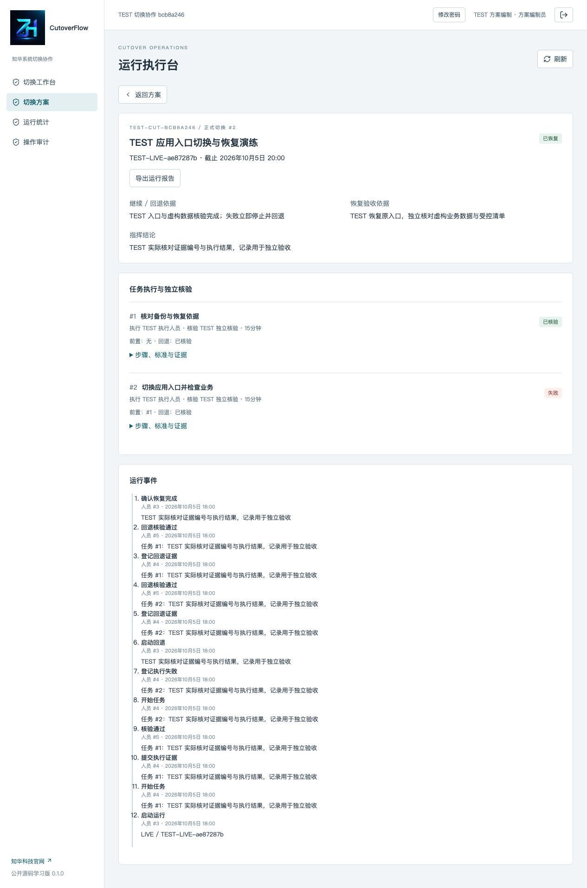
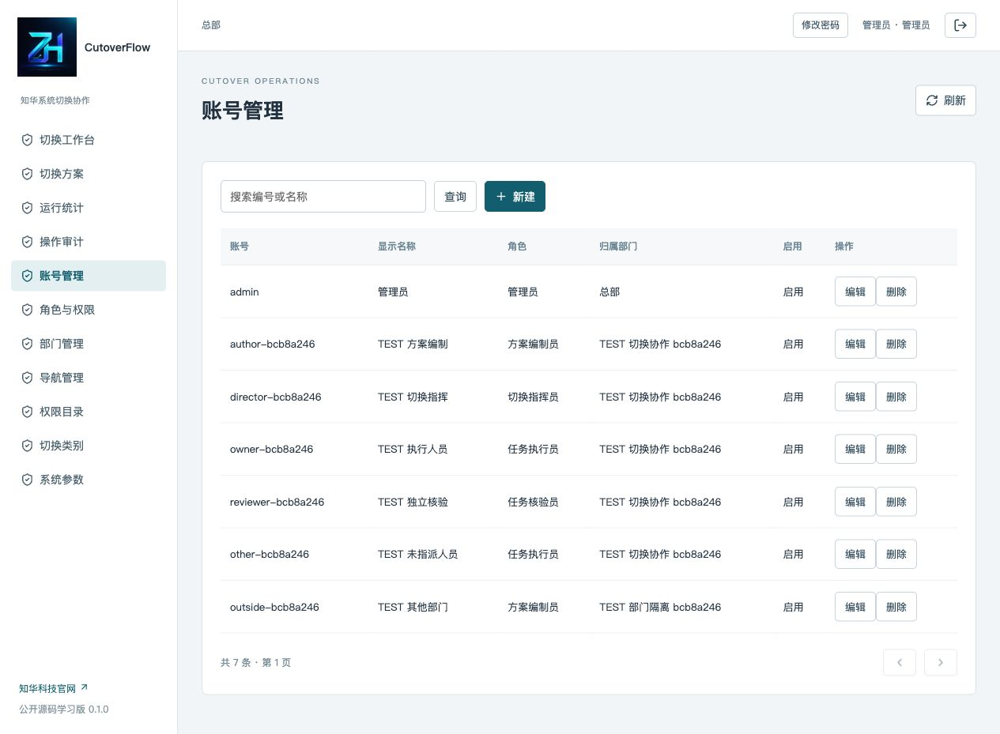
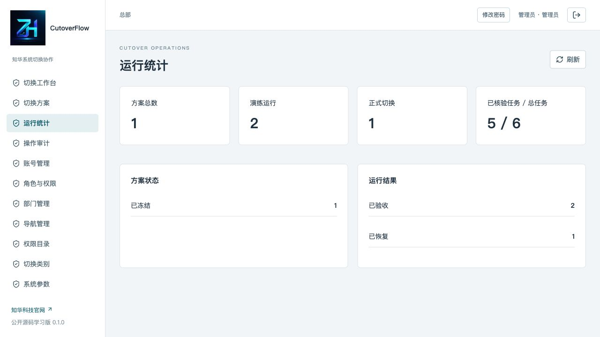
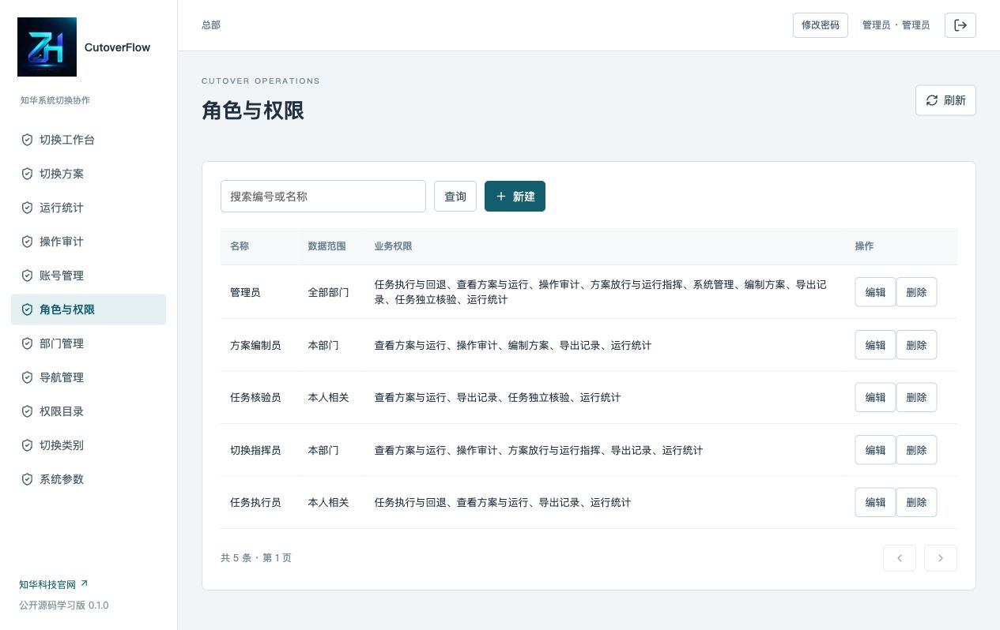

[中文](README.md) | [English](README.en.md)

<p></p>

# CutoverFlow · System Cutover and Rollback Drill Ledger

**Public source for learning 0.1.0 / non-commercial use** · **ZhiHua Technology (Shanghai Rujing Zhihua Information Technology Co., Ltd.)** · [Official website](https://www.zhuatech.cn/)

Java 21 / Spring Boot, Vue 3, MySQL and Flyway provide frozen plans, task dependencies, independent verification and rollback records. In a cross-team cutover window, different people check backups, convert data, switch entry points and verify business functions. CutoverFlow links plans, dependencies, execution evidence and rollback verification for implementation teams, migration coordinators and cutover directors.

**This records manual execution and review.** It does not connect to production hosts, run scripts, migrate databases, change routes or back up/restore operational facilities. Successful registration does not mean actual facilities have switched or recovered. Authorized people execute controlled procedures separately.

## From plan to a checkable run

```text
Draft tasks/dependencies → submit → assigned independent director releases → frozen plan
                                                                        → rehearsal
                                                                        → all tasks independently verified
                                                                        → director accepts
                                                                        → live cutover of same baseline
Failure or manual abort → block new tasks → rollback touched tasks in reverse dependency order
                         → independent verification → director confirms recovery
```

- Each task has executor, independent verifier, planned duration, instructions, acceptance criteria, rollback instructions and predecessors. Branches/joins are supported; cycles, self-reference and cross-plan dependencies are rejected.
- Author/director differ; director cannot execute tasks; executor/verifier differ. Administrators cannot replace assignments.
- Every predecessor must **pass independent verification** before starting. Submitted execution evidence still needs separate review. Failure blocks further starts; there is no forced bypass.
- LIVE needs an accepted rehearsal of the same frozen baseline; one active run per plan. Released tasks cannot change. New arrangements require a new plan/reference and rehearsal.
- Each run keeps separate evidence, states and an execution deadline of at most 48 hours, reducible through settings. After expiry forward progression is blocked; failure/rollback can still be recorded.
- Every started task, including failed tasks, needs rollback. Unstarted tasks do not. A predecessor cannot roll back until every touched successor's rollback is verified. Original execution states/evidence remain separate from rollback records.

## Business and administrative features

| Module | Implemented features |
|---|---|
| Business workspace | Personally linked plans, director work and execution/verification tasks; details, states, history and feedback |
| Plans | Own drafts/CRUD, tasks/dependencies, cycle checks, submission/return, release/freeze and retirement |
| Execution | REHEARSAL/LIVE, predecessor gates, actual evidence, independent pass/fail, reverse rollback and recovery acceptance |
| Queries/reports | Database search/state filters/pagination, created-time/reference sort, scoped counts and run JSON reports |
| Administration | Accounts, roles, permission descriptions, registered menus, departments, dictionaries/settings; last-admin/reference protection |
| Security/audit | BCrypt, sessions, CSRF, live authorization/scopes, own password, business events and audit |

Scopes: ALL across departments, DEPARTMENT within department, SELF for personally authored/directed/executed/verified plans. Associated people can read the complete baseline/runs; actions still require specific assignments. Lists, detail, workspace, statistics and reports share scopes. Administrative interfaces require an ALL administrator.

**Not implemented:** automatic scripts, cloud/CI/CD integration, facility backups/restores, attachments, notifications, plan-template copy, cross-organization tenants, electronic signatures, objective telemetry and dedicated mobile applications. No models, paid AI or external business credentials are required. Text evidence may reference controlled records; there is no electronic notarization or tamper-proof evidence guarantee.

## Actual running pages

Screenshots are from a disposable independent acceptance environment with fictional TEST records, not actual systems/customer data.

| Login | Business workspace |
|---|---|
|  |  |

Login: session authentication. Workspace: associated plans and execution/verification work.

| Frozen plan/dependencies | Execution and rollback |
|---|---|
|  |  |

Plan: frozen task baseline/dependencies. Execution: evidence by assigned executors/verifiers and reverse rollback.

| Accounts | Statistics |
|---|---|
|  |  |

Accounts: departments, roles and enabled state. Statistics: authorized plan/run states.

| Roles and data scopes |
|---|
|  |

Roles: interface permissions and ALL/department/SELF scopes.

Business/admin share a login with permission-governed navigation. See [Operations](docs/操作手册.md); detailed linked manuals are currently in Chinese.

## Requirements and installation

Docker Engine/Desktop, Compose v2 and Python 3.10+. Source development: Java 21, Maven 3.9, Node.js 24.19.0+, npm 11 and MySQL 8.4. Initial builds require official images/public dependency registries.

```sh
python3 scripts/init-env.py
docker compose config --quiet
docker compose up -d --build --wait
```

Open [http://127.0.0.1:8118/](http://127.0.0.1:8118/); [health](http://127.0.0.1:8118/actuator/health). Change local `WEB_PORT` if occupied, e.g. 18118, without stopping another project.

Username `admin`; a random initial `ADMIN_PASSWORD` is in ignored mode-0600 `.env`. No public fixed password exists. The generator refuses to overwrite existing files; if configuration exists, start directly. An empty database creates headquarters, five roles, permissions/menus, categories/settings and the administrator, without successful cutover/recovery facts. Explicit disposable acceptance creates TEST records.

### Configuration

| Name | Purpose |
|---|---|
| `DATABASE_PASSWORD`, `MYSQL_ROOT_PASSWORD` | Required independent application/initial database administration passwords |
| `ADMIN_PASSWORD` | Strong empty-database administrator password; restarts do not reset existing accounts |
| `WEB_PORT`, `BIND_ADDRESS` | Defaults 8118 / 127.0.0.1 |
| `COOKIE_SECURE` | false for local HTTP, true behind external HTTPS |

See [.env.example](.env.example). Host backend can use `DATABASE_URL`, `DATABASE_USER`, `DATABASE_CATALOG` for an independent `zhuatech_cutoverflow` database. Provide addresses/accounts/passwords through controlled configuration; never commit actual values. Default MySQL/backend have no host ports.

### Source development

Prepare an independent MySQL database/account and required backend environment values, then at the repository root:

```sh
cd backend
mvn -B spotless:check test spring-boot:run
```

In another terminal at the root:

```sh
cd frontend
npm ci
npm run dev
```

Vite defaults to local port 5173 and proxies backend 8080. Compose frontend uses service names. Host source execution does not automatically read `.env`; host MySQL access needs a separate database/private loopback mapping. See [Deployment](docs/部署说明.md).

## Architecture, structure and initialization

Backend: Java 21 / Spring Boot 4.0.7 / Security / JPA / Flyway / MariaDB Connector/J 3.5.10. Frontend: Vue 3.5.40 / Vite 8.1.5 / JavaScript / Lucide. MySQL 8.4 and non-root Nginx run under Compose.

```text
Browser → Nginx → Spring Boot → persistent MySQL volume
frontend/src/                 Business/admin pages, forms and state actions
backend/src/main/java/        Identity, authorization, administration and transactions
backend/src/main/resources/db/migration/
  V1__identity.sql            Accounts, roles, menus, departments, dictionaries and audit
  V2__cutover.sql             Plans, tasks, dependencies, runs, evidence and events
backend/src/test/             Unit and HTTP integration tests
scripts/                      Private configuration, actual database acceptance and release checks
docs/                         Operations, architecture/API, deployment, security/tests and pages
```

`cutover_plan`, `cutover_step` and `step_dependency` store the baseline. `cutover_run` / `run_task` store each run and separate evidence. `command_record` binds account, route and structured payload fingerprints for exact retries; `flow_event` retains history. Writes lock headquarters and recheck current authorization at READ COMMITTED; versions reject stale pages. Business/audit events commit together. This is not a distributed high-throughput engine.

READY plans/tasks freeze, so runs reference the same immutable baseline. Display names can change through administration; original actor IDs remain, but historical name snapshots are not implemented. Submitted plans and runs retain history without deletion interfaces. See [Architecture, database and API](docs/架构与接口.md).

Limits: 100 tasks / 200 runs per plan, 1,000-plan statistics, 10,000-directory reads with explicit overlimit rejection, latest 500 events shown while database history remains. Single-organization/single-instance learning deployment; large-scale operations are unverified.

## Database upgrades, deployment and recovery

Flyway creates/version-checks schemas; JPA validates only. First startup does not depend on the developer's database. Preserve applied V1/V2; append higher-version SQL. Before upgrades, pause writes, retain application versions and restricted private configuration, back up the complete database/Flyway history and prove restoration on a separate instance.

Application database backups contain account hashes, plans and evidence; keep them restricted outside public source, mode 0600, without printing credentials/content. Restore into a new Compose project, distinct web port and fresh database volume using matching images. Start MySQL, import the full backup, then start backend/frontend. Verify migrations, account login, frozen baseline, accepted rehearsal, original failed task/rollback evidence and persistence. These steps recover this application's records, not operational facilities documented by the ledger.

After validation, follow the deployment's maintenance/switch procedure. Rollback needs matching application/database versions and a verified preupgrade backup. Never rewrite history or delete actual volumes to handle failure. In-memory sessions require login after backend restart; business/identity facts persist. `docker compose down` retains data. **Remove volumes only for explicitly disposable tests after confirming project identity.**

External hosting requires authorization, HTTPS, Secure cookies, trusted database certificate/hostname validation, controlled access, least privilege, backups and monitoring. Local `sslMode=trust` does not verify certificate chains; use verified external configuration. There is no shared session service or centralized rate limiting. See [Deployment](docs/部署说明.md).

## Validation

```sh
mvn -B -f backend/pom.xml spotless:check test package
cd frontend
npm ci --no-audit --no-fund
npm run format:check
npm run lint
npm test
npm run build
cd ..
docker compose config --quiet
docker compose build
python3 scripts/release-check.py
git diff --check
```

Docker backend builds execute Maven tests without skipping. Isolated H2 unit/HTTP tests and dynamically generated credentials do not replace real MySQL migration/workflow/persistence acceptance. See [Testing and security](docs/测试与安全.md).

Only on a **fresh isolated disposable acceptance database**:

```sh
python3 scripts/smoke.py --base http://127.0.0.1:8118 --env .env --allow-test-writes
python3 scripts/smoke.py --base http://127.0.0.1:8118 --env .env --verify-persistence
```

Write mode creates fictional TEST accounts/plans and verifies dependencies, rehearsal gating, normal acceptance, failure blocking, reverse rollback, independence, scopes, versions and retries. Private ignored `.smoke-state.json` stores test credentials for reauthentication. After restart or separate restoration, select its URL and run verification without write mode. Never publish the state or target production.

## Security, troubleshooting and contributions

HttpOnly/SameSite Strict cookies, CSRF and BCrypt cost 12 protect identity. Eight failures cause a five-minute account/IP limit. Disabled accounts, password changes and withdrawn permissions invalidate later requests. SQL uses bound values/fixed sorts. Keep actual credentials, production addresses, customer data, backups and unredacted logs out of source.

Health failure: inspect this project's services/logs, required configuration and migrations. `STALE_VERSION`: refresh/review. Cannot start: predecessor verification. Cannot roll back: successor rollback review. Keep real database volumes. Menus assist users but are not the authorization boundary; ALL admins still obey business assignments.

Report redacted reproducible issues; privately report security concerns without public credentials/exploits. Contributions need code rights, retained attribution/licenses, small reviewed changes and checks. No customer code/data should be contributed. [Third-party notices](THIRD_PARTY_NOTICES.md) apply separately.

Software is provided as is; operators remain responsible for actual procedures, execution authority, operational risks, data security, backups and applicable rules. No customer-case, certification or go-live guarantee is made.

## License and contact ZhiHua Technology

Own code uses [ZhuaTech Non-Commercial Source License 1.0](LICENSE), permitting personal learning, technical research and non-commercial exchange only. **Commercial use requires prior written authorization from Shanghai Rujing Zhihua Information Technology Co., Ltd.** Enterprise production, paid hosting, SaaS, commercial delivery/resale/training and in-depth customization require authorization. Preserve brand, attribution, copyright, website, license and licensing contacts. Third-party licenses remain separate. This is publicly readable non-commercial source, not an OSI-approved license, with no unverified production-readiness claim.

For commercial licensing, in-depth custom development, deployment or system integration, contact **ZhiHua Technology (Shanghai Rujing Zhihua Information Technology Co., Ltd.)**:

- Website: [https://www.zhuatech.cn/](https://www.zhuatech.cn/)
- Email: [han@zhuatech.cn](mailto:han@zhuatech.cn)
- Email: [jack@zhuatech.cn](mailto:jack@zhuatech.cn)
- WhatsApp: [+86 17521234993](https://wa.me/8617521234993)
